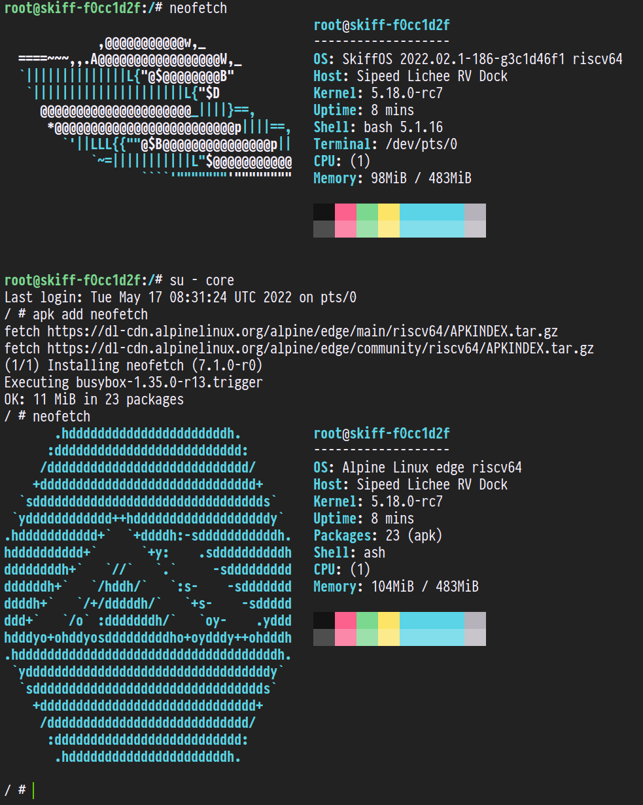

# Sipeed LicheeRV Dock

This configuration package series configures Buildroot to produce a BSP image for the
Sipeed LicheeRV Dock Risc-V Board (and similar).

**Note: this is a RISC-V architecture CPU, not all Docker images will support it.**



References:

 - https://linux-sunxi.org/Sipeed_Lichee_RV
 - https://ovsienko.info/D1/

## Getting Started

Set the comma-separated `SKIFF_CONFIG` variable:

```sh
$ export SKIFF_CONFIG=allwinner/licheerv,core/alpine
$ make configure                   # configure the system
$ make compile                     # build the system
```

Once the build is complete, we will flash to a MicroSD card to boot. You will
need to `sudo bash` for this on most systems.

```sh
$ sudo bash             # switch to root
$ export ALLWINNER_SD=/dev/sdz # make sure this is right! (usually sdb)
$ make cmd/allwinner/d1/format  # tell skiff to format the device
$ make cmd/allwinner/d1/install # tell skiff to install the os
```

You only need to run the `format` step once. It will create the partition table.
The `install` step will overwrite the current Skiff installation on the card,
taking care to not touch any persistent data (from the persist partition). It's
safe to upgrade Skiff independently from your persistent data.

## Building an Image

It's possible to create a .img file instead of directly flashing a SD.

```sh
# must be root to use losetup
sudo bash
# set your skiff workspace
export SKIFF_WORKSPACE=licheerv
# set the output path
export ALLWINNER_IMAGE=./licheerv.img
# make the image
make cmd/allwinner/d1/buildimage
```

The image can then be flashed to the target:

```
# change sdX to, for example, sdb
dd if=licheerv.img of=/dev/sdX status=progress oflag=sync
```

This is equivalent to using the format and install scripts.

The persist partition will be resized to fill the available space on first boot.

## Ethernet over USB

The default configuration enables USB ethernet gadget support.

The IP address of the "host" machine should be 10.0.0.1.

The default IP address of the licheerv will be 10.0.0.3.

### Host machine: setting up with NetworkManager

To setup on the "host" machine with NetworkManager:

 1. Create a new connection configuration in NetworkManager.
 2. Set the interface to the usb interface (usually usb0).
 3. Set the ipv4 mode to Shared.
 4. Set the ipv4 IP address to 10.0.0.1.
 5. Save & exit.

This will enable connection sharing with the licheerv over USB.

The equivalent nmconnection file for the above:

```
[connection]
id=usbgadget
uuid=5349d6bb-6ee2-4c6d-8b70-4a9ebfa947b2
type=ethernet
interface-name=usb0

[ipv4]
address1=10.0.0.1/8
may-fail=false
method=shared
never-default=true

[ipv6]
method=disabled
```

### Host machine: setting up with iptables

To setup on the "host" machine without using NetworkManager:

```sh
# add an ip address to usb0
ip addr add 10.0.0.1/24 dev usb0

# Enabling forwarding internet traffic on behalf of the device:
# You can change OUTGOING to your outgoing interface (i.e. wlan0)
# OUTGOING="wlan0"
OUTGOING=$(ip route get 1.1.1.1 | cut -d" " -f5 | head -n1)
iptables -t nat -A POSTROUTING -s 10.0.0.3/32 -o ${OUTGOING} -j MASQUERADE
iptables -A FORWARD -s 10.0.0.3 -j ACCEPT
echo 1 > /proc/sys/net/ipv4/ip_forward
```

### Changing device IP address

To change the IP address of the device, override the usb0.nmconnection.

Create a file under the SkiffOS root:

`./overrides/root_overlay/etc/NetworkManager/system-connections/usb0.nmconnection`

Use the following as the contents:

```
[connection]
id=usb
uuid=004ae043-8866-4fa3-819a-8b5031c70c59
type=ethernet
interface-name=usb0

[ethernet]

[ipv4]
address1=10.0.0.3/8,10.0.0.1
dns=1.1.1.1;
method=manual

[ipv6]
addr-gen-mode=stable-privacy
method=disabled
```

You can then change the IP address under the `address1` field.
