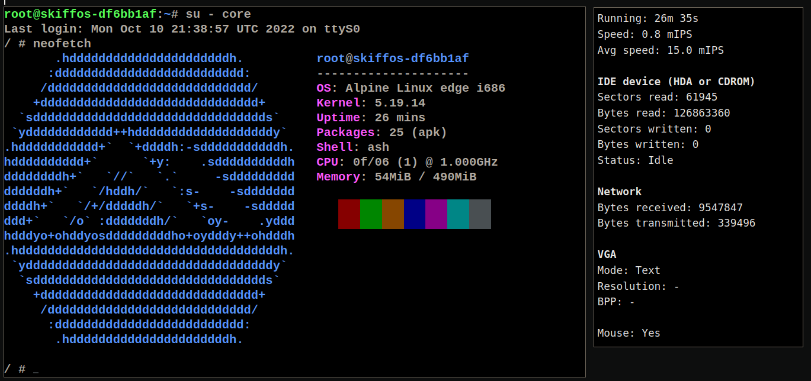

# V86 Emulator

**Runs SkiffOS in the web browser with the [V86 Emulator].**

[V86 Emulator]: https://github.com/copy/v86



## Demos

A [pre-built demo image] is available.

[pre-built demo image]: https://drive.google.com/file/d/1UFoUEt1CQrD8B4800ii9yehff68h9IPG/view?usp=sharing

Load the ISO into the v86 emulator:

 1. Open https://copy.sh/v86/
 2. Scroll down to "Setup."
 3. Increase the memory size to at least 512MB.
 4. Click "CD image" and select the ISO.
 5. Click "start."

After the system boots, in the serial terminal below:

 1. Enter `root` as username to login and press enter.
 2. Run `docker ps` to view the list of containers.
 3. Run `su - core` to switch into the Alpine Linux environment.

## Compiling from Source

Set the comma-separated `SKIFF_CONFIG` variable:

```sh
$ export SKIFF_CONFIG=browser/v86,skiff/core
$ make configure                   # configure the system
$ make compile                     # build the system
```

The ISO is `rootfs.iso9660` in `workspaces/${SKIFF_WORKSPACE}/images`.

## Running V86 in Docker

You can [run the server] for v86 with Docker.

[run the server]: https://github.com/copy/v86#alternatively-to-build-using-docker
