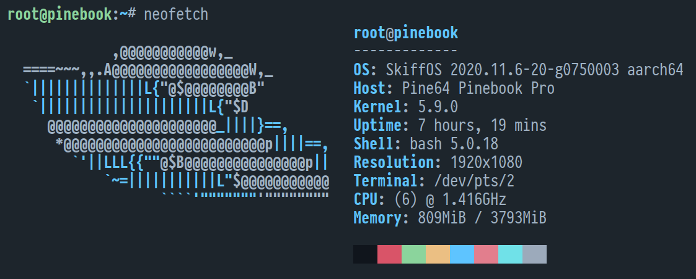

# Pine64 PineBook



This configuration package `pine64/book` compiles a Skiff base operating system
for the PineBook Pro.

References: 

 - https://linux-sunxi.org/Pine_Pinebook
 - https://wiki.pine64.org/index.php/Pinebook
 - https://wiki.pine64.org/index.php/Pinebook_Pro
 - https://github.com/samueldr/wip-pinebook-pro

## Getting Started

Set the comma-separated `SKIFF_CONFIG` variable:

```sh
$ export SKIFF_CONFIG=pine64/book,core/pinebook_gentoo
$ make configure                   # configure the system
$ make compile                     # build the system
```

Once the build is complete, it's time to flash the system. There are several
approaches, please see the "Flashing" section in the [common readme].

[common readme]: ../

## GentooLTO with KDE for Pinebook

Add `core/pinebook_gentoo` to enable the GentooLTO based KDE for Pinebook Pro.

Downloads the `skiffos/skiff-core-gentoo-kde:pinebook-lto` image at first boot,
which contains an up-to-date GentooLTO (optimizations O3) installation with a
variety of kde desktop apps, and lightdm / x11 pre-configured with Panfrost
hardware acceleration.

## XFCE with NixOS

Add `core/nixos_xfce` to SKIFF_CONFIG to enable "Skiff Core" with XFCE Desktop
configured.

## Flashing U-boot to Internal Emmc

Note: the PineBook will, on default, boot from the internal emmc with higher
priority than the MicroSD card.

Skiff's u-boot with adjusted boot priority can be flashed to the emmc from a
running pinebook system using two files from the images dir:

```sh
dd if=idbloader.img of=/dev/mmcblk0 seek=64 oflag=dsync,notrunc
dd if=u-boot.itb of=/dev/mmcblk0 seek=16384 oflag=dsync,notrunc
```

This will allow the system to boot from the SD card with higher priority than
the internal emmc, if found containing a valid u-boot flash.

### Recovering from broken u-boot flash

If, for some reason, the machine does not boot properly after flashing the emmc,
you will need to use the following steps to force a boot to the microsd card:

 1. Power off the laptop.
 2. Remove the back plate.
 3. Switch the "emmc" switch to "off."
 4. Insert a working SD card.
 5. Power on the laptop. 
 6. When the power LED lights, immediately switch the emmc to "on."

If done correctly, the EMMC will be available in the system booted to the
working MicroSD card. The u-boot image on the emmc can then be flashed back to a
working state from the running system.

## Known Issues

The following are known upstream issues:

 - Suspends to memory, rather than a deep sleep state
 - U-boot/TF-A requires a 32 bit arm compiler
   - Skiff distributes pre-built u-boot binaries to fix this.
   - Can re-compile the blobs from scratch with this repo:
   - https://github.com/skiffos/rk3399-firmware-blobs

