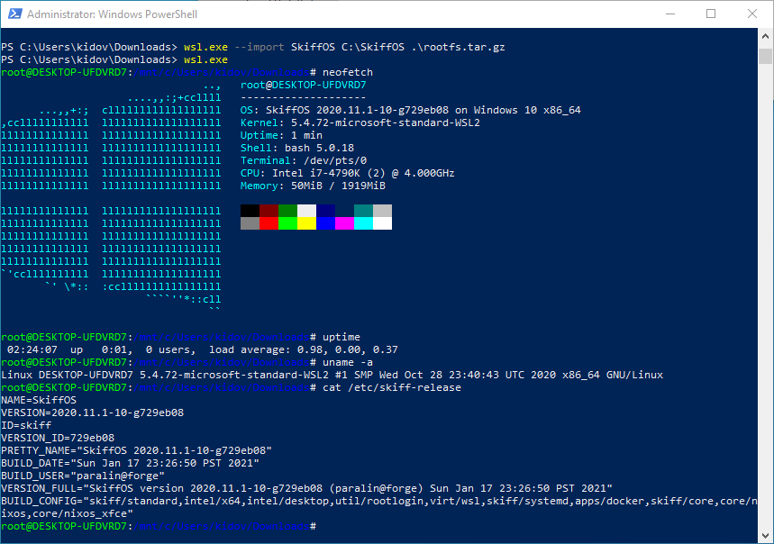

# Windows Subsystem for Linux



This package adds support for running SkiffOS inside WSL.

**WSL2*** runs a full Linux kernel in a VM. **WSL1** runs the Linux userspace
only. This package is compatible with **WSL2***, and does not fully support
**WSL1**, due to the lack of support for loop devices.

The following example builds WSL with Docker and Skiff Core:

```sh
export SKIFF_CONFIG=virt/wsl,skiff/core
export SKIFF_WORKSPACE=wsl
make configure compile
```

The below instructions cover loading the distribution into a host machine.

Reference:

 - https://docs.microsoft.com/en-us/windows/wsl/about#what-is-wsl-2
 - https://docs.microsoft.com/en-us/windows/wsl/compare-versions

## WSL2

Note: currently WSL2 is only available on Windows Insider builds.

Last updated: January 2021.

To enable WSL2, follow [this guide] summarized here with the below steps:

```
dism.exe /online /enable-feature /featurename:Microsoft-Windows-Subsystem-Linux /all /norestart
dism.exe /online /enable-feature /featurename:VirtualMachinePlatform /all /norestart
wsl.exe --set-default-version 2
wsl.exe --update
```

[this guide]: https://aka.ms/wsl2-install

You can then import the SkiffOS build output `skiffos.tar.gz`:

```
# import, creating rootfs file at storage path
wsl.exe --import SkiffOS C:\Path\To\Storage C:\path\to\images\skiffos.tar.gz
# shutdown the system so that WSL reads wsl.conf
wsl.exe --shutdown

# enter the distro
wsl.exe -d skiffos

# list
wsl.exe --list --all -v
# delete all files for distro
wsl.exe -d SkiffOS
```

WSL2 will be configured to use skiff-init-squashfs to run systemd inside a PID
namespace. The system then behaves identically to any other SkiffOS system,
including the ability to OTA using the "push_image.sh" script. Docker and all
other tools run correctly.

## OTA Upgrading the Skiff System

The SkiffOS system can be remotely updated similarly to most other target
systems using the `push_image.sh` script to rsync the updated files:

```
export SKIFF_WORKSPACE=wsl
./scripts/push_image.sh root@my-wsl-system
```

Note that my-wsl-system should be the ssh server running in the Skiff system.

## Configuring WSL2

WSL2 has two methods for configuration: editing the `/mnt/persist/etc/wsl.conf`
file, and editing the `$env:USERPROFILE/.wslconfig` file in Windows.

The documentation for the settings is available at the [wsl-config docs].

[wsl-config docs]: https://docs.microsoft.com/en-us/windows/wsl/wsl-config#wsl-2-settings

An example for changing the resources allocated to WSL2:

```
# notepad $env:USERPROFILE/.wslconfig
[wsl2]
memory=3GB
swap=4GB
processors=4
```

## Upgrading the WSL2 Kernel

The WSL2 kernel is configured per Windows user. It's not possible for Skiff to
override it from within the distribution.

Copy the Skiff vmlinux to your Windows home, and create a file ".wslconfig":

```
[wsl2]
kernel=C:\\Users\\myuser\\vmlinux
```

Then run `wsl.exe --shutdown` to force wsl to restart.

NOTE: the kernel produced by Skiff does not start properly in WSL2 (yet).

## Running Graphical Apps

Install the [GWSL](https://opticos.github.io/gwsl/) tool on the Windows host.

In your "core" container, add the following configuration to `~/.profile` or `/etc/profile`:

```
export DISPLAY=$(cat /etc/resolv.conf | grep nameserver | awk '{print $2; exit;}'):0.0
```

All X11 apps will now be forwarded correctly to the Windows host.

## Running WSL2 in a Virtualbox Machine

Note: as of January 2021, VirtualBox does not support SLAT pass-through, and the
VM will show the warning "Hyper-V cannot be enabled, the CPU does not support
SLAT" or similar. You will need to run the VM directly with Hyper-V instead of
using VirtualBox to get this to work until SLAT pass-through is implemented.

However, if SLAT pass-through is working:

To enable nested virtualization extensions, required for operating WSL2 inside a
VirtualBox machine, run the following command:

```
VBoxManage modifyvm "My VM Name" --nested-hw-virt on
```

This will enable it even if the box is greyed out in the UI. You may need to go
to the "Windows Features" dialog and enable "Windows Hypervisor Platform."
Windows needs to start-up the Hyper-V subsystem at boot time; if it's not loaded
properly, WSL2 won't work with a vague error about enabling the VM platform.

#### Migrating a VirtualBox Machine to Qemu

One possible work-around is to use Qemu instead, which supports SLAT.

Nested virtualization must be enabled in KVM on Intel, check this is "Y":

```
cat /sys/module/kvm_intel/parameters/nested
```

Convert the VM image into the Qemu format:

```
qemu-img convert -f vdi -O raw WindowsVM.vdi QemuWindowsVM.img
```

When importing, use the "use existing disk image" option.

### Running a Windows 10 Qemu/KVM Machine

To test WSL2 on a Linux host, a Windows 10 VM can be run in KVM.

This requires "nested Hyper-V" which requires "SLAT" - second layer address
translation. On Intel CPUs, the QEMU command line must include the +vmx cpu
feature, for example:

```
-cpu SandyBridge,hv_relaxed,hv_spinlocks=0x1fff,hv_vapic,hv_time,+vmx
```


## WSL1 (Legacy)

WSL 1 does not support loop devices, and Skiff won't fully work. To use WSL1,
load the **rootfs.tar.gz** instead of **skiffos.tar.gz**. While you won't be
able to use systemd, docker, OTA, and most core Skiff functionality, the
environment will at least be usable for basic tasks.

Download the WSL distro launcher for SkiffOS:

```sh
git clone https://github.com/SkiffOS/WSL-DistroLauncher
cd WSL-DistroLauncher/x64
cp ../../../skiff/workspaces/wsl/images/rootfs.tar.gz ./install.tar.gz
```

You will need a Windows machine to compile the Appx containing SkiffOS with a
self-signed certificate. You also will need to make sure that the "developer"
options are enabled so that "side-loading" apps from files is allowed.

Open `SkiffOS-Appx/SkiffOS.appxmanifest` with Visual Studio. If you do not see a
configuration GUI, you likely will need to install the Visual Studio extra
features "Universal Windows Platform C++ tools" and "Windows 10 SDK for UWP."

Select "Packaging" and "Choose Certificate" and then "Create."

To sideload your appx on your machine for testing, right-click on the "Solution
(DistroLauncher)" in the Solution Explorer and click "Deploy Solution". This
should build the project and sideload it automatically for testing. To
unregister the project, run "wslconfig.exe /unregister".

To compile a release image: Close Visual Studio and open the "Developer Prompt
for Visual Studio." Use `cd` to change directories to the WSL-DistroLauncher
project. Run the "build.bat" script. Note: this is generally less reliable than
running the Visual Studio deploy approach.

## Known Issues

On WSL 1.0:

 - Set BR2_TARGET_ROOTFS_TAR=y BR2_TARGET_ROOTFS_TAR_GZIP=y to use
 - Load rootfs.tar.gz 
 - OTA not supported
 - Older Windows builds: containerd crashes due to a mmap bug
 - systemd, docker does not work correctly

On WSL 2.0:

 - vmlinux produced by Skiff does not yet work properly
 - likely requires Windows Insider builds
 - TODO: implement a nsenter routine for the shells
